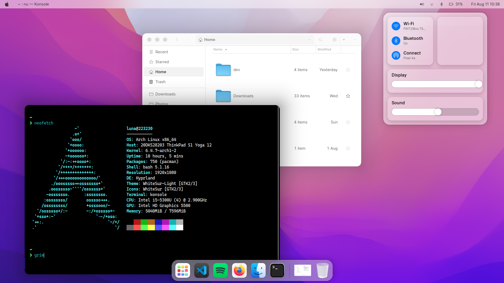
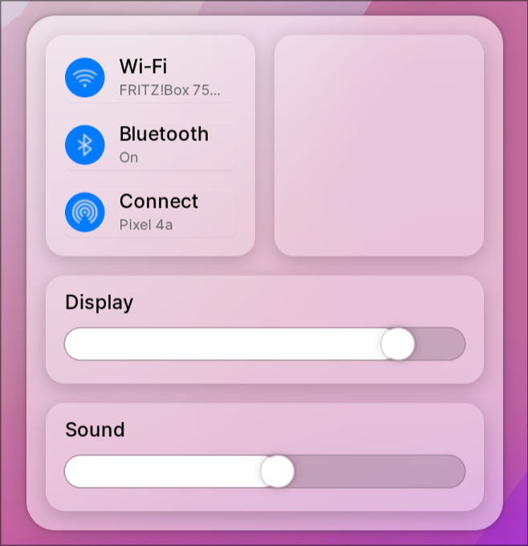
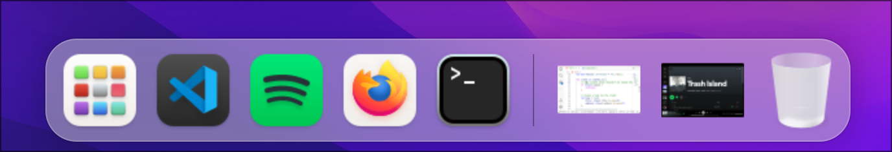

# A Mac-like Shell for eww and hyprland

You'll think you're on a Mac. Only works on [hyprland](https://hyprland.org/).



> **Warning**
> This project is at a veeeeeeeeeery early stage. As such, I'm not looking
> for contributors as of right now. Don't file any issues telling me that
> parts of this don't work! I already know that :P

## Highlights

  * Auto-hidden Dock
  * Control center
  * Previews for minimized windows
  * Lots of Rust

<center>
  
</center>



## Requirements

This list probably isn't exhaustive, as I've not actually *tried* installing
this on any other machine. So you're most definitely going to get errors when you
try to use this config as is. Ehh, what can you do.

  * Rust and Cargo
  * NetworkManager
  * Brightnessctl
  * PaMixer
  * WhiteSur icons

## Installing

This config uses Rust for scripts, so you're gonna need to compile some
Rust code and copy the build into `scripts/bin`.

> **Note**
> Yeah, this is kind of annoying. In the future, I'll probably provide an
> automatic installer that does all of this for you.

Clone the repository
```sh
git clone https://github.com/223230/eww-mac-shell/
```

Get in there
```sh
cd eww-mac-shell
```

Compile the tasks script
```sh
cd scripts/hyprland-tasks && cargo build --release
cp target/release/hyprland-tasks ../bin
```

Compile the minimize script
```sh
cd ../hyprland-minimize && cargo build --release
cp target/release/hyprland-minimize ../bin
```

Copy everything into your eww config directory.
```sh
cd ..
cp * ~/.config/eww
```

You're done! Yippee!!

## Legal

Mac and macOS are trademarks of Apple Inc., registered in the U.S. and
other countries and regions. I am not affiliated with Apple Inc.